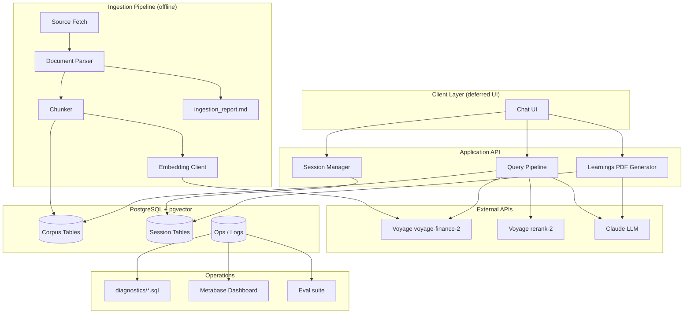
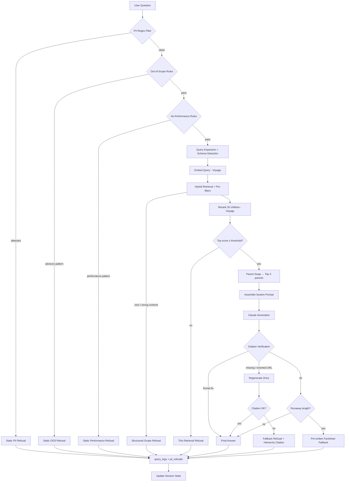
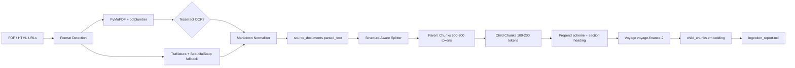
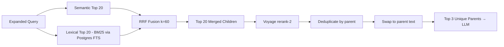
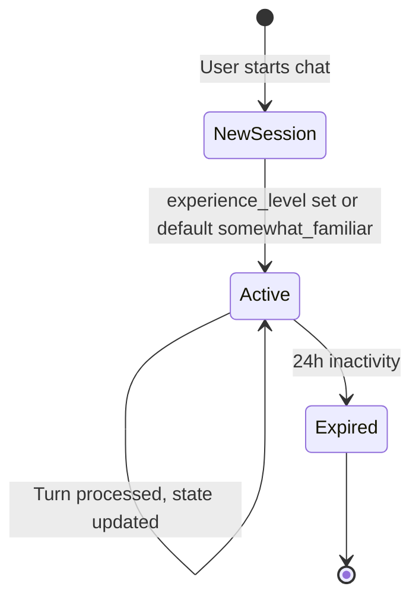
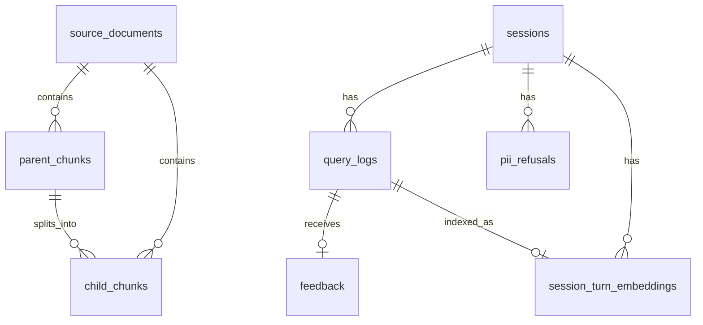

# RAG Mutual Fund FAQ Bot — System Architecture

> **Derived from:** `context.md` (locked feature inventory and decisions).  
> **Authority:** When this document conflicts with `context.md`, `context.md` wins. Phase sections in `context.md` are the source of truth for implementation details.

---

## 1. Purpose and Scope

### 1.1 What the system does

The ICICI Prudential Mutual Fund FAQ Bot is a **retrieval-augmented generation (RAG)** system that answers factual questions about four in-scope mutual fund schemes using a curated corpus of ~20 web/PDF documents. It:

- Retrieves grounded answers from authoritative sources (factsheets, KIMs, AMC pages, AMFI, SEBI, registrar help).
- Refuses investment advice, performance claims, and PII-containing queries.
- Adapts tone and depth to the user's experience level (`new`, `somewhat_familiar`, `expert`).
- Maintains session context for multi-turn conversations (24-hour window, no cross-session memory).
- Enforces **one citation link per factual answer** with programmatic verification.
- Logs every turn for diagnostics, evals, and operational monitoring.

### 1.2 In-scope domain

| Dimension | Value |
|-----------|-------|
| AMC | ICICI Prudential Asset Management Company |
| Schemes (4) | Bluechip (large-cap), Flexicap, ELSS Tax Saver, Balanced Advantage |
| Corpus size | ~20 pages (15–25 cap) |
| User identity | Anonymous session UUID; no login, no name capture |

**Corpus composition:**

- 12 scheme docs: 4 schemes × (factsheet + KIM + scheme page)
- 4 AMC-level pages: FAQ, fees/charges, investor service (statements), Knowledge Centre
- 4 regulatory/industry pages: AMFI investor education, AMFI riskometer, SEBI MF regulations, CAMS/KFintech statement help

### 1.3 Explicit boundaries

| Category | Examples |
|----------|----------|
| **Rejected** | HyDE, knowledge graphs, multi-hop agents, CRAG, cross-session memory, LLM scheme detection, hard 3-sentence cap |
| **Deferred** | Full UI design, chunk summarization, automated re-parsing cron, scheduled regulatory re-research |
| **In-repo** | End-to-end eval suite (`evals.md`, `docs/EVAL_SUITE_BRIEF.md`) |

---

## 2. High-Level Architecture

### 2.1 Logical component map



### 2.2 Runtime vs offline paths

| Path | Trigger | Frequency | Writes DB |
|------|---------|-----------|-----------|
| **Ingestion** | Manual re-ingestion procedure | At build + 1–2 cycles per semester | `source_documents`, `parent_chunks`, `child_chunks` |
| **Query** | User message | Per turn | `sessions`, `query_logs`, optional `feedback`, `pii_refusals`, `session_turn_embeddings` |
| **Learnings PDF** | Explicit user action | On demand | `sessions.learnings_generated_at`; transient file on disk |
| **Diagnostics** | Operator / scheduled rollup | On demand / periodic | Read-only |

---

## 3. Query Pipeline (Critical Path)

Every user turn flows through a **sequential pipeline** with early exits. Order is locked.



### 3.1 Stage summary

| Stage | Mechanism | LLM? | Budget |
|-------|-----------|------|--------|
| PII filter | Regex (PAN, Aadhaar, account, OTP, email, phone) | No | ≤50ms (shared) |
| Out-of-scope | Rule patterns + LLM in prompt for ambiguous | Rules: no; ambiguous: yes | ≤50ms (shared) |
| No-performance | Rule patterns + LLM in prompt | Rules: no | ≤50ms (shared) |
| Query expansion | Synonym dictionary; semantic always, lexical conditional | No | ≤50ms (shared) |
| Scheme detection | Hard-coded name + variant list | No | ≤50ms (shared) |
| Embedding | `voyage-finance-2` | No (API) | ≤400ms |
| Retrieval | pgvector + Postgres FTS, RRF k=60 | No | ≤100ms |
| Reranking | `rerank-2` on 20 children | No (API) | ≤600ms |
| Generation | Claude | Yes | ≤2.5s per call |
| Post-processing | Citation verify, reformat, tag strip | No | ≤100ms |

**End-to-end targets:** p50 ≤ 2s, p95 ≤ 4s, hard ceiling 6s.  
**Cost targets:** ≤ $0.05/query normal, ≤ $0.10 with regeneration.

### 3.2 Response paths

| Path | LLM invoked? | Citation verified? |
|------|--------------|-------------------|
| PII / pattern-matched OOS / pattern-matched performance | No — static templates | No (redirect links only) |
| Scope / thin retrieval refusals | No — structured templates | No |
| Factual answer | Yes | Yes — format + URL provenance |
| Mixed factual + advisory | Yes (factual part) | Yes on factual portion only |
| Learnings PDF summary | Yes (reformat only) | URLs preserved from originals |

---

## 4. Ingestion Pipeline

### 4.1 Flow



### 4.2 Parsing rules

| Input | Primary | Fallback | Output |
|-------|---------|----------|--------|
| PDF prose | PyMuPDF | — | Markdown |
| PDF tables | pdfplumber | — | Prose or markdown table |
| Scanned PDF | Tesseract OCR | — | Logged loudly |
| HTML | Trafilatura | BeautifulSoup + CSS selectors | Markdown |

**Table policy:** Simple label-value rows → prose. Multi-column tables (e.g. holdings) → markdown tables kept whole in parent-sized units.

### 4.3 Chunking model

| Layer | Size | Embedded? | Role |
|-------|------|-----------|------|
| **Child** | 100–200 tokens, ~10% overlap | Yes | Retrieval unit; precise matching |
| **Parent** | 600–800 tokens, structural (heading-bounded) | No | LLM context unit after parent swap |

Every child has a non-null `parent_chunk_id`. Short sections use **self-parent** (parent text = child text, no embedding on parent).

**Metadata per chunk (8 fields):** source name, source type, URL, date/version, scheme name, section heading, parent chunk ID, authority level. Filterable fields are typed columns; remainder in JSONB.

### 4.4 Versioning

- `source_documents.is_latest = TRUE` for the current ingested version per `source_url`. Distinct URLs are independent; scheme-level queries may match multiple latest documents.
- Retrieval joins `child_chunks` to `source_documents` with `is_latest = TRUE`; older versions of the same URL are excluded by default.

### 4.5 Failure handling

- Failed parse: skip document, log warning, continue batch.
- Pre-launch: manual review of `ingestion_report.md` (status, char count, chunk count per document).

---

## 5. Retrieval Architecture

### 5.1 Hybrid retrieval



| Parameter | Value |
|-----------|-------|
| Semantic index | `child_chunks.embedding` vector(1024), HNSW or IVFFlat |
| Lexical index | Postgres `tsvector` / `tsquery` + `ts_rank` |
| Fusion | Reciprocal Rank Fusion, k = 60 |
| Candidates | 20 semantic + 20 lexical → 20 fused |
| Rerank input | 20 child chunks |
| Rerank output | Top 3 unique parents |

**Rerank failure:** Retry once → fail open to RRF order, log event.

### 5.2 Pre-retrieval filters (SQL WHERE)

Applied **before** both semantic and lexical search. **No fallback to unfiltered search.**

| Filter | Logic |
|--------|-------|
| Scheme | Hard-coded detector: 4 scheme names + variants → `scheme_name` |
| Version | Join `source_documents` on `child_chunks.document_id` with `is_latest = true` (per `source_url`, not per scheme) |
| Authority | **Not** filtered at retrieval; used in citation hierarchy post-retrieval |

**Zero-result behavior:**

1. Ambiguous scheme mention → clarification prompt.
2. Out-of-scope scheme → list 4 schemes + AMC factsheet directory link.
3. Distinguish wrong scheme vs right scheme with no data.

### 5.3 Query expansion (Option B)

Single synonym dictionary in application code. Examples: `annual fee` ↔ `expense ratio` ↔ `TER`, `withdrawal` ↔ `redemption`.

| Search type | Expansion |
|-------------|-----------|
| Semantic | Always expand (merged query string) |
| Lexical (BM25) | Expand only when user-side synonym detected |

### 5.4 Grounding threshold

- Hard reranker-score threshold (placeholder until Phase 5 threshold sweep).
- Below threshold → skip LLM, return thin-retrieval refusal.
- Rationale: mutual-fund domain has strong LLM prior knowledge; prompts alone are insufficient.

### 5.5 Parent assembly for LLM

Each parent sent with metadata header:

```text
[Source: <source_name>, <date_version> | URL: <source_url>]
<parent chunk text>
```

Order: highest reranker rank first.

---

## 6. Generation and Safety Layer

### 6.1 Citation hierarchy

When multiple sources are retrieved, **which source to cite** follows this order:

| Fact type | Primary | Fallback |
|-----------|---------|----------|
| Scheme numbers (expense ratio, NAV, riskometer, benchmark) | Factsheet | KIM → scheme page |
| Scheme rules (SIP min, exit load, lock-in, objective) | KIM | Factsheet |
| General concepts (ELSS, riskometer, expense ratio) | AMFI | ICICI Pru Knowledge Centre |
| Regulatory / investor rights | SEBI | — |
| Statement downloads | ICICI Pru investor service | CAMS/KFintech |

Cite the primary source for the **main fact** the user asked about when an answer combines multiple facts.

### 6.2 System prompt assembly

**File:** `prompts/system_prompt.md` with placeholders.

**Static block (top):** identity → scope rules → grounding → citation → answer format.

**Dynamic block (bottom):** experience level → conversation state → retrieved sources → user question.

**Few-shots:** 12 examples total (4 categories × 3 levels); inject **4** matching current level from `prompts/experience_levels/<level>/examples/<category>.md`.

| Experience level | Default? | Tone |
|------------------|----------|------|
| `new` | No | Plain language, term explanations, warm |
| `somewhat_familiar` | **Yes (default)** | Standard terminology, neutral |
| `expert` | No | Precise, terse, no preamble |

Level changes only via explicit user commands (`explain simpler`, `more technical`, etc.).

### 6.3 Answer format (factual)

```text
<answer body>

Last updated from sources: <date>
Source: [<source_name>, <date_version>](<source_url>)
```

- No hard sentence cap; length driven by experience level.
- Runaway safety net: ~250 words / ~8 sentences on body only → pre-written factsheet fallback (never mid-sentence truncation).
- LLM outputs `[FACTUAL]` or `[REFUSAL]` tag; stripped before display.

### 6.4 Citation enforcement

| Check | Action on failure |
|-------|-------------------|
| Format wrong, URL correct | Reformat in code |
| Citation missing | Regenerate once |
| Invented URL (not in retrieved set) | Regenerate once + **loud log** |
| Persistent failure | Structured refusal with hierarchy-based authoritative link |

Audit trail: `query_logs.citation_flow` JSONB.

### 6.5 Refusal categories (`query_logs.refusal_category`)

| Value | Trigger |
|-------|---------|
| `pii` | PII regex match |
| `out_of_scope` | Advisory / opinion query |
| `no_performance` | Performance computation or lookup |
| `thin_retrieval` | Below grounding threshold |
| `mixed_factual_advisory` | Partial answer + partial refusal |
| `NULL` | Successful factual answer |

---

## 7. Session and Context Architecture

### 7.1 Session lifecycle



- **No cross-session memory.** Returning after 24h = new session.
- `sessions.user_identifier`: anonymous UUID, not human name.

### 7.2 Context reignition (dual-mode)

**State contents (`sessions.current_state` JSONB):**

| Component | Behavior |
|-----------|----------|
| Structured facts | Always loaded whole; append-only (schemes discussed, refusals, level changes) |
| Recent turns | Rolling window of last 5 Q&A pairs verbatim |
| Older turns | In `query_logs`; not loaded by default in long sessions |

**Mode switching:**

| Mode | When | Raw turns |
|------|------|-----------|
| Load-whole | State &lt; ~5000 tokens (default) | All in prompt |
| Retrieval | State ≥ ~5000 tokens | Embedded in `session_turn_embeddings`; retrieved per query |

**Turn embedding:** `User: <question> | Bot: <answer>` as single string, `voyage-finance-2`, scoped to session.

**Fact extraction:** Rule-based only (scheme detector, refusal categorizer, level commands). No per-turn LLM summarization.

### 7.3 Selective warmth

Encoded in `prompts/experience_levels/<level>/instructions.md`. LLM-side detection guided by per-level rules. No separate warmth logging column.

---

## 8. Data Architecture

### 8.1 Entity relationship



### 8.2 Table groups

#### Corpus (ingestion)

| Table | Purpose |
|-------|---------|
| `source_documents` | Full parsed markdown per document; versioning via `is_latest` |
| `parent_chunks` | 600–800 token sections for LLM context |
| `child_chunks` | 100–200 token searchable units + `vector(1024)` embedding |

#### Session (runtime)

| Table | Purpose |
|-------|---------|
| `sessions` | Experience level, `current_state` JSONB, `learnings_generated_at` |
| `query_logs` | Full turn audit: retrieval, prompt, latencies, cost, citation_flow |
| `feedback` | Thumbs up/down per turn |
| `pii_refusals` | PII type + timestamp only; **no content** |
| `session_turn_embeddings` | Session-scoped turn vectors for long conversations |

### 8.3 Intentional denormalization

`source_url`, `source_name`, `date_version`, `section_heading` appear in:

- `source_documents` (canonical)
- `parent_chunks.metadata` / `child_chunks.metadata` (query convenience)

Filter columns (`scheme_name`, `source_type`, `authority_level`) are typed on chunk tables for index-backed WHERE clauses.

### 8.4 Indexes

| Index | Target |
|-------|--------|
| HNSW or IVFFlat | `child_chunks.embedding` |
| B-tree | `child_chunks.scheme_name`, `source_type`, `authority_level` |
| B-tree / GIN | Lexical FTS on child chunk text |
| FK indexes | Standard on foreign keys for joins |

---

## 9. Product Features (Backend)

### 9.1 Experience-level selector

- Captured at session start (skippable → default `somewhat_familiar`).
- Mid-session change via explicit commands only.
- `query_logs.experience_level` denormalized per turn for analytics.

### 9.2 Post-chat learnings document

| Aspect | Decision |
|--------|----------|
| Trigger | On-demand user action |
| Format | PDF via HTML template + WeasyPrint |
| Sections | Header, key facts, transcript, sources, gaps, full disclaimer |
| Summarization | Light LLM reformat; substantive content **verbatim** from bot answers |
| Sanity check | Word-overlap vs source answers |
| Disclaimer | Static from `templates/learnings_document_disclaimer.md` |
| Retention | Server copy ~1 hour at `/data/learnings/<session_id>/document.pdf` |

---

## 10. Operations Architecture

### 10.1 Observability data model

Every turn writes to `query_logs` with:

- Per-stage latency columns (`latency_*_ms`)
- `cost_usd` (Voyage embed + rerank + Claude)
- `retrieved_chunks` JSONB (pre/post rerank ranks, scores)
- `citation_flow` JSONB
- `final_prompt`, `raw_llm_output`, `final_answer`

### 10.2 Diagnostic queries

**Location:** `diagnostics/*.sql` (~15–20 parameterized queries)

| Category | Example signals |
|----------|-----------------|
| Retrieval | Thin retrieval, wrong chunk cited, similarity distribution |
| Reranking | Top-1 dropped after rerank, parent dedup collisions, latency outliers |
| Generation | Regeneration reasons, fallback answers, raw vs final diff |
| Citation | Invented URLs, hierarchy adherence, citation inconsistency |

**CLI:** `diag <query-name> [--params]`

**Thumbs-down family:** `thumbs_down_review.sql`, `aggregate_thumbs_down_by_failure_mode.sql`

### 10.3 Dashboard (Metabase)

- Self-hosted Docker, read-only Postgres role.
- ~8 panels: latency, cost, quality summary, retrieval signals, session signals, thumbs-down drill-down.
- Diagnostic SQL imported as saved queries.
- Live refresh; no caching layer at project scale.

### 10.4 Eval suite

Implemented in this repo. Inputs from locked design (`docs/EVAL_SUITE_BRIEF.md`, `evals.md`):

- Scheme detector, query expansion, OOS detector, performance detector, warmth eval
- Grounding threshold sweep, citation consistency, source overlap
- Answer quality on brief examples, regulatory verbatim verification

### 10.5 Added-complexity gate

Any new pipeline layer requires:

1. Eval evidence of failure mode it fixes.
2. Latency within per-stage budget.
3. Cost within per-query budget.
4. No simpler alternative (prompt, threshold, dictionary) would suffice.

---

## 11. Repository Layout (Target)

```text
RAG project/
├── context.md                 # Locked decisions (source of truth)
├── architecture.md            # This document
├── source_list.md             # Corpus URLs
├── ingestion_report.md        # Generated at ingest
├── README.md
│
├── prompts/
│   ├── system_prompt.md
│   └── experience_levels/
│       ├── new/
│       │   ├── instructions.md
│       │   └── examples/
│       ├── somewhat_familiar/
│       └── expert/
│
├── templates/
│   ├── regulatory/
│   │   ├── mandatory_disclaimers.md
│   │   ├── scope_statements.md
│   │   └── authoritative_links.md
│   └── learnings_document_disclaimer.md
│
├── diagnostics/
│   ├── thumbs_down_review.sql
│   └── ...
│
├── data/
│   └── learnings/<session_id>/document.pdf  # transient
│
└── .cursor/rules/
    └── rag-bot-context.mdc
```

---

## 12. External Dependencies

| Service | Model / Tool | Usage |
|---------|--------------|-------|
| Voyage AI | `voyage-finance-2` | Document + query + session-turn embeddings (1024 dims) |
| Voyage AI | `rerank-2` | Rerank 20 child candidates |
| Anthropic | Claude | Answer generation, ambiguous filter classification, learnings reformat |
| PostgreSQL | + pgvector | Corpus storage, FTS, vectors, all operational tables |
| PyMuPDF, pdfplumber, Tesseract | — | PDF parsing |
| Trafilatura, BeautifulSoup | — | HTML parsing |
| WeasyPrint (or equivalent) | — | Learnings PDF |
| Metabase | Docker | Ops dashboard |
| Eval suite | — | Eval generation and judging in-repo |

**Single embedding model constraint:** `voyage-finance-2` for documents, queries, and session turns — required for meaningful vector comparison.

---

## 13. Security and Compliance

### 13.1 PII handling

- Pre-retrieval regex gate; hard refusal, no sanitize-and-continue.
- PII content **never stored**; only `pii_refusals.pii_type` + timestamp.
- Optional post-generation PII check as belt-and-braces.

### 13.2 Regulatory content

| Category | Location |
|----------|----------|
| Mandatory disclaimers | UI footer, learnings doc, performance refusals |
| Scope statements | System prompt, UI welcome, learnings header |
| Authoritative redirects | Refusal templates, citation fallbacks |

Templates in `templates/regulatory/`. Draft at build time + **mandatory manual review** before ship. Annual review expectation in README.

### 13.3 Data access

- Metabase: read-only DB role.
- No user authentication in v1; session isolation by `session_id`.

---

## 14. Non-Goals and Future Scope

The following are explicitly **out of scope** for the current architecture:

- Investment recommendations, portfolio advice, performance quoting
- Cross-session memory and user accounts
- Automated document change detection and cron re-ingestion
- Real-time operational alerting
- Per-query LLM-as-judge citation alignment
- Knowledge graphs, HyDE, multi-hop agents, CRAG

**Deferred to later:** full chat UI, retrieved-chunk summarization if prompts crowd, scheduled regulatory re-research.

---

## 15. Architecture Decision Index

Quick reference mapping major decisions to `context.md` phases.

| Decision | Phase | Status |
|----------|-------|--------|
| Parent-child chunking with post-rerank swap | 1 / 2 | Locked |
| Voyage embed + rerank single vendor | 1 / 2 | Locked |
| Postgres hybrid retrieval (no separate search engine) | 2 | Locked |
| Hard-coded scheme filter, strict zero-result | 2 | Locked |
| Regex PII pre-retrieval | 3 | Locked |
| Static templates for pattern-matched refusals | 3 | Locked |
| Programmatic citation enforcement | 3 | Locked |
| Experience levels + context reignition dual-mode | 4 | Locked |
| On-demand learnings PDF with verbatim facts | 4 | Locked |
| Eval suite + diagnostic SQL + Metabase | 5 | Locked |

For implementation details, schema column lists, refusal message templates, and eval test cases, see **`context.md`**.
