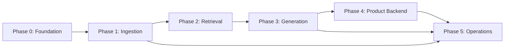

# RAG Mutual Fund FAQ Bot — Phase-Wise Implementation Plan

> **Derived from:** `context.md` (locked decisions) and `architecture.md` (system design).  
> **Authority:** If this plan conflicts with `context.md`, follow `context.md`.  
> **Goal:** Build order, dependencies, deliverables, and verification steps for each phase — not re-specify every locked decision.

---

## How to use this document

1. Complete phases **sequentially** — each phase depends on the previous unless noted.
2. Check off tasks as you go; do not skip **acceptance criteria** before moving on.
3. Do not add features listed under **What's OUT** in `context.md` (HyDE, knowledge graphs, cross-session memory, etc.).
4. UI is **deferred** — use a minimal API/CLI harness until the chat UI is built separately.

---

## Phase dependency overview



| Phase | Depends on | Unblocks |
|-------|------------|----------|
| 0 — Foundation | — | All phases |
| 1 — Ingestion | Phase 0 | Phase 2, evals, diagnostics |
| 2 — Retrieval | Phase 1 corpus in DB | Phase 3 factual answers |
| 3 — Generation | Phase 2 retrieval path | Phase 4, Phase 5 evals |
| 4 — Product backend | Phase 3 query pipeline | Learnings PDF, full session UX |
| 5 — Operations | Phase 1–3 logging | Launch readiness, tuning |

---

## Phase 0 — Foundation (prerequisites)

**Objective:** Repo scaffold, infrastructure, corpus inventory, and API keys — no RAG logic yet.

### Tasks

| # | Task | Output |
|---|------|--------|
| 0.1 | Initialize project structure per `architecture.md` §11 | `prompts/`, `templates/`, `diagnostics/`, `data/` dirs |
| 0.2 | Choose app stack (e.g. Python + FastAPI, or Node) and add dependency file | `requirements.txt` or `package.json` |
| 0.3 | Docker Compose: PostgreSQL 15+ with `pgvector` extension | `docker-compose.yml` |
| 0.4 | Environment config for Voyage + Anthropic keys (never commit secrets) | `.env.example` |
| 0.5 | Finalize `source_list.md` — all 17 URLs with scheme, type, authority level | `source_list.md` |
| 0.6 | Stub `README.md` (scope, setup, env vars) — expand in Phase 5 | `README.md` |
| 0.7 | Create read-only Postgres role for future Metabase | DB migration or SQL script |

### Deliverables

- [ ] Postgres + pgvector running locally
- [ ] `source_list.md` with 17 corpus URLs categorized
- [ ] Empty folder scaffold matching target repo layout
- [ ] `.env.example` documenting required API keys

### Acceptance criteria

- `psql` connects; `CREATE EXTENSION vector` succeeds
- All four schemes represented in source list with factsheet + KIM + scheme page
- AMC-level and regulatory URLs present (AMFI, SEBI, registrar)

---

## Phase 1 — Ingestion

**Objective:** Parse ~20 documents → markdown → parent/child chunks → Voyage embeddings → Postgres corpus tables.

**Reference:** `context.md` Phase 1; `architecture.md` §4.

### 1.1 Database schema (corpus tables)

| # | Task | Details |
|---|------|---------|
| 1.1.1 | Migration: `source_documents` | All columns per `context.md` including `is_latest`, `parsed_text` |
| 1.1.2 | Migration: `parent_chunks` | FK to `source_documents`; filter columns + JSONB metadata |
| 1.1.3 | Migration: `child_chunks` | `embedding vector(1024)`; indexes on filter columns |
| 1.1.4 | Vector index | HNSW or IVFFlat on `child_chunks.embedding` |
| 1.1.5 | FTS setup | `tsvector` column + GIN index on child chunk searchable text |

### 1.2 Document parsing

| # | Task | Details |
|---|------|---------|
| 1.2.1 | PDF parser module | PyMuPDF primary; pdfplumber for table-heavy sections |
| 1.2.2 | Table handling | Key-value → prose; multi-column → markdown tables |
| 1.2.3 | OCR fallback | Tesseract when page text &lt; ~100 chars; loud logging |
| 1.2.4 | HTML parser module | Trafilatura primary; BeautifulSoup + CSS selectors fallback |
| 1.2.5 | Markdown normalizer | Unified post-processing for PDF and HTML output |
| 1.2.6 | Parse failure handling | Skip + warn; do not halt batch |

### 1.3 Chunking

| # | Task | Details |
|---|------|---------|
| 1.3.1 | Structure-aware splitter | Heading/section boundaries; recursive fallback for oversized sections |
| 1.3.2 | Parent chunks | 600–800 tokens; structural definition |
| 1.3.3 | Child chunks | 100–200 tokens; ~10% overlap |
| 1.3.4 | Self-parent rule | Short sections: parent row mirrors child (no embedding on parent) |
| 1.3.5 | Metadata attachment | 8 fields per chunk; typed filter columns + JSONB |
| 1.3.6 | Pre-embedding prepend | Scheme name + section heading on child text before embed |

### 1.4 Embedding and storage

| # | Task | Details |
|---|------|---------|
| 1.4.1 | Voyage client | `voyage-finance-2`; 1024-dim output |
| 1.4.2 | Batch embed child chunks | Store in `child_chunks.embedding` |
| 1.4.3 | Version flags | Set `is_latest` per `source_url`; demote prior rows on re-ingest of same URL |
| 1.4.4 | Denormalize metadata | `source_url`, etc. in chunk JSONB for query convenience |

### 1.5 Ingestion CLI / script

| # | Task | Details |
|---|------|---------|
| 1.5.1 | `ingest` command | Read `source_list.md` → fetch → parse → chunk → embed → DB |
| 1.5.2 | `ingestion_report.md` generator | Per doc: type, status, char count, chunk count |
| 1.5.3 | Manual re-ingestion procedure | Document in README (factsheet monthly updates) |

### Phase 1 deliverables

- [ ] `source_documents`, `parent_chunks`, `child_chunks` populated (~20 docs)
- [ ] `ingestion_report.md` reviewed manually before Phase 2
- [ ] Sample parsed markdown inspectable in DB or export for QA
- [ ] Ingestion script rerunnable without re-parsing if only re-chunking needed

### Phase 1 acceptance criteria

- Every in-scope URL has a row in `source_documents` (success or logged failure)
- Child count &gt; 0 for all successful documents
- Spot-check 3 documents: markdown headings, tables, scheme metadata correct
- Vector similarity smoke test: query "expense ratio Bluechip" returns Bluechip-related chunks in top 5

### Phase 1 — do not build

- Session tables (Phase 3/4)
- Retrieval fusion or reranking (Phase 2)
- LLM calls (Phase 3)

---

## Phase 2 — Retrieval

**Objective:** End-to-end retrieval path from user query to top 3 parent chunks — no LLM generation yet.

**Reference:** `context.md` Phase 2; `architecture.md` §5.

**Prerequisites:** Phase 1 complete; corpus embedded.

### 2.1 Scheme detection and filters

| # | Task | Details |
|---|------|---------|
| 2.1.1 | Scheme name registry | 4 canonical names + variant map (e.g. "blue chip" → Bluechip) |
| 2.1.2 | Scheme detector function | Hard-coded match; no LLM |
| 2.1.3 | Pre-filter SQL builder | `scheme_name` on chunks; join `source_documents` with `is_latest = true` (per URL) |
| 2.1.4 | Zero-result handlers | Clarification vs scope refusal vs factsheet link (no unfiltered fallback) |

### 2.2 Query expansion

| # | Task | Details |
|---|------|---------|
| 2.2.1 | Synonym dictionary | `annual fee` ↔ `expense ratio` ↔ `TER`, etc. |
| 2.2.2 | Semantic expansion path | Always merge original + variants into one string |
| 2.2.3 | Lexical expansion path | Expand only when user-side synonym detected |
| 2.2.4 | Unit-test expander | Casual vs formal vs no-match cases |

### 2.3 Hybrid retrieval

| # | Task | Details |
|---|------|---------|
| 2.3.1 | Query embedding | Same `voyage-finance-2` model as corpus |
| 2.3.2 | Semantic search | pgvector top 20 on filtered `child_chunks` |
| 2.3.3 | Lexical search | Postgres FTS top 20 on same filtered set |
| 2.3.4 | RRF fusion | k = 60; merge to top 20 child candidates |

### 2.4 Reranking and parent swap

| # | Task | Details |
|---|------|---------|
| 2.4.1 | Voyage `rerank-2` client | 20 children in → scored list out |
| 2.4.2 | Parent deduplication | Keep highest-ranked child per `parent_chunk_id` |
| 2.4.3 | Parent swap | Replace children with parent `text` from `parent_chunks` |
| 2.4.4 | Metadata headers | `[Source: name, date | URL: url]` prepended to each parent |
| 2.4.5 | Rerank failure handling | Retry once → fail open to RRF order + log |

### 2.5 Grounding threshold (placeholder)

| # | Task | Details |
|---|------|---------|
| 2.5.1 | Threshold config | Placeholder constant in config (tuned in Phase 5) |
| 2.5.2 | Thin-retrieval refusal template | Structured message when top score below threshold |
| 2.5.3 | Log reranker top score | For later threshold sweep eval |

### 2.6 Retrieval harness

| # | Task | Details |
|---|------|---------|
| 2.6.1 | `retrieve` CLI or debug endpoint | Input query → print top 3 parents + scores |
| 2.6.2 | Latency timing | Per-stage ms for embed, retrieval, rerank |

### Phase 2 deliverables

- [ ] Scheme detector with variant coverage
- [ ] Synonym dictionary module
- [ ] Hybrid retrieval + rerank + parent swap pipeline
- [ ] Debug harness showing parents with metadata headers
- [ ] Thin-retrieval refusal when below threshold

### Phase 2 acceptance criteria

- Scheme filter: "bluechip expense ratio" retrieves only Bluechip chunks (manual + detector eval prep)
- Wrong scheme: query about out-of-scope fund returns scope refusal, not unfiltered results
- Rerank changes order vs RRF on at least one test query
- Parent swap: returned context is 600–800 token sections, not tiny children
- Retrieval stage total ≤ 100ms locally (excluding API calls); embed ≤ 400ms; rerank ≤ 600ms typical

### Phase 2 — do not build

- LLM generation (Phase 3)
- Citation verification (Phase 3)
- Session state (Phase 4)

---

## Phase 3 — Generation

**Objective:** Full query pipeline with input filters, Claude generation, citation enforcement, logging — minimal chat API.

**Reference:** `context.md` Phase 3; `architecture.md` §3, §6.

**Prerequisites:** Phase 2 retrieval path working.

### 3.1 Session and logging schema

| # | Task | Details |
|---|------|---------|
| 3.1.1 | Migration: `sessions` | `experience_level`, `current_state` JSONB, timestamps |
| 3.1.2 | Migration: `query_logs` | All latency columns, `citation_flow`, `retrieved_chunks`, etc. |
| 3.1.3 | Migration: `feedback` | thumbs_up / thumbs_down |
| 3.1.4 | Migration: `pii_refusals` | type + timestamp only; no content |

### 3.2 Input filters (pre-retrieval)

| # | Task | Details |
|---|------|---------|
| 3.2.1 | PII regex module | PAN, Aadhaar, account, OTP, email, phone |
| 3.2.2 | PII static refusal template | Hard refusal; log to `pii_refusals` without query text |
| 3.2.3 | Out-of-scope rule patterns | "should I", "recommend me", etc. → static refusal |
| 3.2.4 | No-performance rule patterns | return, CAGR, performance, yield, etc. |
| 3.2.5 | Static refusal templates | PII, OOS, performance — no LLM for pattern matches |
| 3.2.6 | Filter ordering | PII → OOS → performance → retrieval |

### 3.3 Prompt system

| # | Task | Details |
|---|------|---------|
| 3.3.1 | `prompts/system_prompt.md` | Static sections + placeholders |
| 3.3.2 | Experience level instructions | `prompts/experience_levels/<level>/instructions.md` × 3 |
| 3.3.3 | Few-shot examples | 4 categories × 3 levels = 12 files under `examples/` |
| 3.3.4 | Prompt assembler | Inject level, few-shots (4 of 12), state, sources, question |
| 3.3.5 | Section order | Identity → scope → grounding → citation → format → level → state → sources → question |

### 3.4 Regulatory templates (initial)

| # | Task | Details |
|---|------|---------|
| 3.4.1 | Stub `templates/regulatory/*` | Placeholders until Phase 5 regulatory research |
| 3.4.2 | Wire scope statements into system prompt identity section |

### 3.5 Generation pipeline

| # | Task | Details |
|---|------|---------|
| 3.5.1 | Claude client | Generation with sufficient max tokens (no mid-sentence cutoff) |
| 3.5.2 | Connect retrieval → prompt → LLM | Only when above grounding threshold |
| 3.5.3 | `[FACTUAL]` / `[REFUSAL]` tag handling | Strip before display; drive verifier path |
| 3.5.4 | Mixed factual + advisory path | Answer factual + decline advisory; log `mixed_factual_advisory` |
| 3.5.5 | Answer length runaway check | ~250 words / ~8 sentences → pre-written factsheet fallback |

### 3.6 Citation enforcement

| # | Task | Details |
|---|------|---------|
| 3.6.1 | Format regex | `Source: [name, date](url)` end-of-answer line |
| 3.6.2 | URL provenance check | Cited URL ∈ retrieved chunks' `source_url` set |
| 3.6.3 | Failure paths | Reformat in code; regen once; fallback refusal with hierarchy link |
| 3.6.4 | `citation_flow` JSONB writer | All audit fields per `context.md` |
| 3.6.5 | Citation hierarchy selector | Pick primary source for main fact type |

### 3.7 Query API and logging

| # | Task | Details |
|---|------|---------|
| 3.7.1 | `POST /chat` or CLI `ask` | session_id + message → answer |
| 3.7.2 | Per-turn `query_logs` write | Full audit trail including `final_prompt`, latencies, `cost_usd` |
| 3.7.3 | `POST /feedback` | Link rating to `turn_id` |
| 3.7.4 | Cost calculator | Voyage embed + rerank + Claude tokens → `cost_usd` |

### Phase 3 deliverables

- [ ] Full query pipeline with all early-exit paths
- [ ] System prompt + 12 few-shot files + assembler
- [ ] Citation enforcement with regen + fallback
- [ ] `query_logs` populated on every turn
- [ ] Minimal API or CLI for manual Q&A testing

### Phase 3 acceptance criteria

- PII in query: refusal in &lt; 50ms; no embedding call; row in `pii_refusals`
- "Should I buy Bluechip?": OOS refusal without retrieval (if pattern matched)
- "What is the CAGR of Bluechip?": performance refusal with factsheet redirect
- Factual query: answer with valid citation URL from retrieved set
- Invented URL in LLM output: triggers regen or fallback; logged in `citation_flow`
- `Last updated from sources:` line present on factual answers
- End-to-end p50 target ≤ 2s on typical query (measure over 10 runs)

### Phase 3 — do not build

- Context reignition retrieval mode (Phase 4)
- Learnings PDF (Phase 4)
- Metabase / diagnostic SQL (Phase 5)

---

## Phase 4 — Product Layer (Backend)

**Objective:** Experience levels, multi-turn context, selective warmth, on-demand learnings PDF.

**Reference:** `context.md` Phase 4; `architecture.md` §7, §9.

**Prerequisites:** Phase 3 query pipeline stable for single-turn factual Q&A.

### 4.1 Experience-level selector

| # | Task | Details |
|---|------|---------|
| 4.1.1 | Session start: capture level | Skippable → default `somewhat_familiar` |
| 4.1.2 | `POST /session` or start flow | Store `sessions.experience_level` immediately |
| 4.1.3 | Mid-session level commands | "explain simpler", "more technical", etc. |
| 4.1.4 | Denormalize `query_logs.experience_level` per turn |
| 4.1.5 | Warmth rules in per-level `instructions.md` | Beginner / somewhat / expert tone + affirming phrases |

### 4.2 Context reignition

| # | Task | Details |
|---|------|---------|
| 4.2.1 | `current_state` JSONB schema | Structured facts: schemes, refusals, preferences (append-only) |
| 4.2.2 | Rolling window | Last 5 turns verbatim in state |
| 4.2.3 | Rule-based fact extraction | Scheme detector, refusal category, level commands — no LLM |
| 4.2.4 | Load-whole mode | Default when state &lt; ~5000 tokens |
| 4.2.5 | Migration: `session_turn_embeddings` | vector(1024) per turn |
| 4.2.6 | Retrieval mode | Trigger at ~5000 tokens; back-embed existing turns |
| 4.2.7 | Session-scoped turn retrieval | pgvector lookup for relevant past exchanges |
| 4.2.8 | Session expiry | 24h inactivity clears state |

### 4.3 Multi-turn reference resolution

| # | Task | Details |
|---|------|---------|
| 4.3.1 | Test harness | "What is Bluechip's expense ratio?" → "What about its exit load?" |
| 4.3.2 | Scheme context in state | "its" resolves via structured facts |

### 4.4 Post-chat learnings document

| # | Task | Details |
|---|------|---------|
| 4.4.1 | `templates/learnings_document_disclaimer.md` | Static regulatory wording |
| 4.4.2 | HTML template | 6 sections per `context.md` |
| 4.4.3 | LLM reformat step | Verbatim substantive content only |
| 4.4.4 | Word-overlap sanity check | Extracted facts vs original answers |
| 4.4.5 | WeasyPrint PDF generation | `/data/learnings/<session_id>/document.pdf` |
| 4.4.6 | 1-hour server retention + delete job or TTL |
| 4.4.7 | `GET /learnings/{session_id}` download endpoint |
| 4.4.8 | Set `sessions.learnings_generated_at` |

### Phase 4 deliverables

- [ ] Experience level wired from session start through prompts
- [ ] Multi-turn context (load-whole + retrieval mode)
- [ ] Learnings PDF on demand for any session length
- [ ] `session_turn_embeddings` populated for long sessions

### Phase 4 acceptance criteria

- Skip level selector → `somewhat_familiar` applied on first message
- "explain simpler" mid-session → next turn uses `new` instructions; logged per turn
- 6+ turn session crossing 5000 tokens → retrieval mode activates; relevant old turn surfaced
- Learnings PDF: facts match verbatim answers; disclaimers from template not LLM
- Session inactive 24h → new session on return

### Phase 4 — do not build

- Chat UI (deferred)
- User name capture
- Cross-session memory

---

## Phase 5 — Operations

**Objective:** Eval suite, diagnostic SQL, regulatory research, Metabase dashboard, README completion, brief deliverables.

**Reference:** `context.md` Phase 5; `architecture.md` §10, §13.

**Prerequisites:** Phase 3 logging live; Phase 1 ingestion report exists.

### 5.1 Regulatory research and templates

| # | Task | Details |
|---|------|---------|
| 5.1.1 | 7-item regulatory research | Market-risk disclaimer, performance disclaimers, AMC language, etc. |
| 5.1.2 | Manual review pass | Verbatim disclaimers; official URLs only |
| 5.1.3 | Finalize `templates/regulatory/*.md` | mandatory_disclaimers, scope_statements, authoritative_links |
| 5.1.4 | Wire into refusal templates, learnings doc, system prompt |
| 5.1.5 | UI disclaimer snippet file | For deferred UI; wording from regulatory templates |

### 5.2 Eval suite

| # | Task | Details |
|---|------|---------|
| 5.2.1 | Scheme detector eval | Hard-coded scheme list + variants |
| 5.2.2 | Query expansion eval | Semantic always-expand; lexical conditional |
| 5.2.3 | Out-of-scope detector eval | Rule patterns + prompt layer |
| 5.2.4 | No-performance detector eval | Performance vocabulary patterns |
| 5.2.5 | Selective warmth eval | Per experience-level instructions |
| 5.2.6 | Grounding threshold sweep | Set production `GROUNDING_THRESHOLD` in config |
| 5.2.7 | Citation consistency eval | Same question → same citation |
| 5.2.8 | Source overlap eval | Multi-document fact handling |
| 5.2.9 | Answer-quality eval | Brief / `sample_qa.md` examples |
| 5.2.10 | Regulatory verbatim verification eval | Mandatory disclaimers unchanged |

**Action:** Run eval suite per `docs/EVAL_SUITE_BRIEF.md` and `evals.md`; integrate threshold result from 5.2.6 into `.env`.

### 5.3 Diagnostic queries

| # | Task | Details |
|---|------|---------|
| 5.3.1 | `diagnostics/retrieval/*.sql` | Thin retrieval, wrong citation chunk, similarity distribution |
| 5.3.2 | `diagnostics/reranking/*.sql` | Top-1 drop, parent dedup, latency outliers |
| 5.3.3 | `diagnostics/generation/*.sql` | Regeneration reasons, fallback answers |
| 5.3.4 | `diagnostics/citation/*.sql` | Invented URLs, hierarchy adherence |
| 5.3.5 | `thumbs_down_review.sql` | Full turn context for negative feedback |
| 5.3.6 | `aggregate_thumbs_down_by_failure_mode.sql` | Auto-classify failure stage |
| 5.3.7 | Operational health rollup SQL or script | Invented URLs, regen rate, refusal rate |
| 5.3.8 | `diag` CLI wrapper | `diag <query-name> [--params]` |

Target: ~15–20 parameterized queries total.

### 5.4 Metabase dashboard

| # | Task | Details |
|---|------|---------|
| 5.4.1 | Metabase Docker service in Compose | Local-only |
| 5.4.2 | Connect read-only Postgres role | |
| 5.4.3 | Import diagnostic SQL as saved questions | |
| 5.4.4 | Build ~8 panels | Latency, cost, quality, retrieval, session, thumbs-down drill-down |
| 5.4.5 | Live refresh on page load | No cache layer |

### 5.5 README and brief deliverables

| # | Task | Details |
|---|------|---------|
| 5.5.1 | Complete `README.md` | Scope, limits, setup, env, manual re-ingestion |
| 5.5.2 | Added-complexity gate | Document in README |
| 5.5.3 | Operational tuning escalation | Latency/cost levers when budgets exceeded |
| 5.5.4 | Annual regulatory review expectation | |
| 5.5.5 | `sample_qa.md` | Representative Q&A from eval or manual curation |
| 5.5.6 | Working prototype demo path | API/CLI documented for graders |

### Phase 5 deliverables

- [ ] Final regulatory templates (manually reviewed)
- [ ] Eval suite run + grounding threshold set
- [ ] `diagnostics/` SQL + CLI
- [ ] Metabase dashboard operational
- [ ] Complete README + sample Q&A + UI disclaimer snippet
- [ ] `ingestion_report.md` from final ingest

### Phase 5 acceptance criteria

- Grounding threshold updated from eval sweep; thin-refusal rate acceptable
- Regulatory verbatim eval passes on UI snippet, learnings doc, performance refusals
- `diag thumbs_down_review` returns usable row for a seeded thumbs-down
- Metabase shows latency p50/p95 and cost trend from real query traffic
- All brief deliverables checklist in `context.md` complete

---

## Cross-phase milestones

Use these as go/no-go checkpoints.

| Milestone | After phase | Demo |
|-----------|-------------|------|
| **M1: Corpus live** | Phase 1 | Show ingestion report + vector search smoke test |
| **M2: Retrieval demo** | Phase 2 | CLI prints top 3 parents for 5 sample questions |
| **M3: Single-turn bot** | Phase 3 | Factual answer + citation; refusals for PII/advice/performance |
| **M4: Multi-turn product** | Phase 4 | Follow-up question + learnings PDF download |
| **M5: Launch ready** | Phase 5 | Eval summary + Metabase + README + sample Q&A |

---

## Suggested build order (within phases)

When parallelizing work, respect this ordering:

```text
Phase 1:  schema → parsers → chunker → embed → ingest CLI → report
Phase 2:  scheme detector → expansion → semantic → lexical → RRF → rerank → parent swap → harness
Phase 3:  session/log schema → PII → OOS/perf filters → prompts → LLM → citation → API
Phase 4:  experience level → state JSONB → load-whole → turn embeddings → retrieval mode → PDF
Phase 5:  regulatory templates → eval suite → diagnostics SQL → Metabase → README
```

---

## Brief deliverables tracker

From `context.md` — map to phases.

| Deliverable | Phase |
|-------------|-------|
| Working prototype | Phase 3 (minimal) → Phase 4 (full) |
| Source list MD | Phase 0 |
| README | Phase 0 stub → Phase 5 complete |
| Sample Q&A file | Phase 5 |
| UI disclaimer snippet | Phase 5 (wording from regulatory templates) |
| ingestion_report.md | Phase 1 |

---

## Risk register (implementation)

| Risk | Mitigation |
|------|------------|
| PDF parse quality poor on factsheets | Review `ingestion_report.md`; escalate to pdfplumber/OCR per doc |
| Grounding threshold wrong | Threshold sweep in Phase 5; placeholder in Phase 2 |
| Citation invented URLs | Programmatic provenance check + loud logging + diagnostic SQL |
| Latency exceeds 4s p95 | Reduce candidates 20→10, `rerank-2-lite`; see README escalation |
| Regulatory wording wrong | Manual review mandatory; verbatim eval |
| Scope creep (UI, agents, graphs) | Refer to `context.md` What's OUT; defer UI explicitly |

---

## Document map

| Document | Role |
|----------|------|
| `context.md` | Locked decisions — source of truth |
| `architecture.md` | System design, diagrams, data model |
| `implementation-plan.md` | This file — build order and checklists |
| `source_list.md` | Corpus URLs |
| `ingestion_report.md` | Parse/chunk QA at ingest |
| `README.md` | Operator and grader documentation |

When implementing a task, read the relevant section in `context.md` for exact column names, refusal message structure, and eval expectations before coding.
